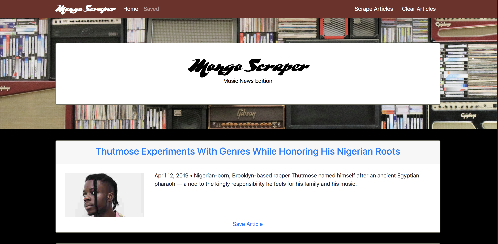
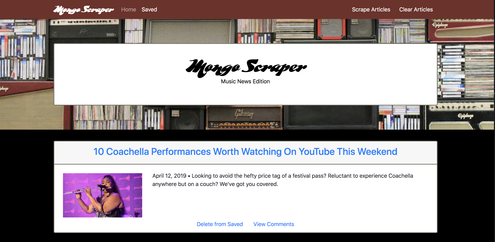
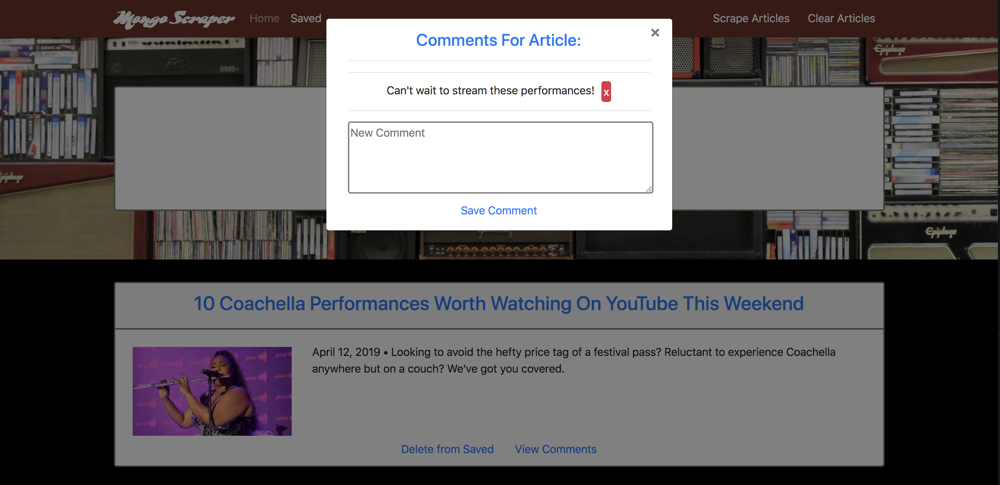

# Mongo Scraper (Music News Edition)
Application for scraping, saving, and commenting on music related journalism.

Check out the demo [here] (https://powerful-ridge-13042.herokuapp.com/).

## Homepage After Scrape 

## Page of Saved Articles

## Comment View and Submit

## Installation Instructions
* Clone this repository 
* Navigate to your repository and type `npm install` This will install all the npm packages necessary for this application

## Technologies Used
* MongoDB
* Mongoose
* Express
* Express-Handlebars
* Cheerio
* Axios
* JQuery
* Javascript
* Bootstrap
* CSS
